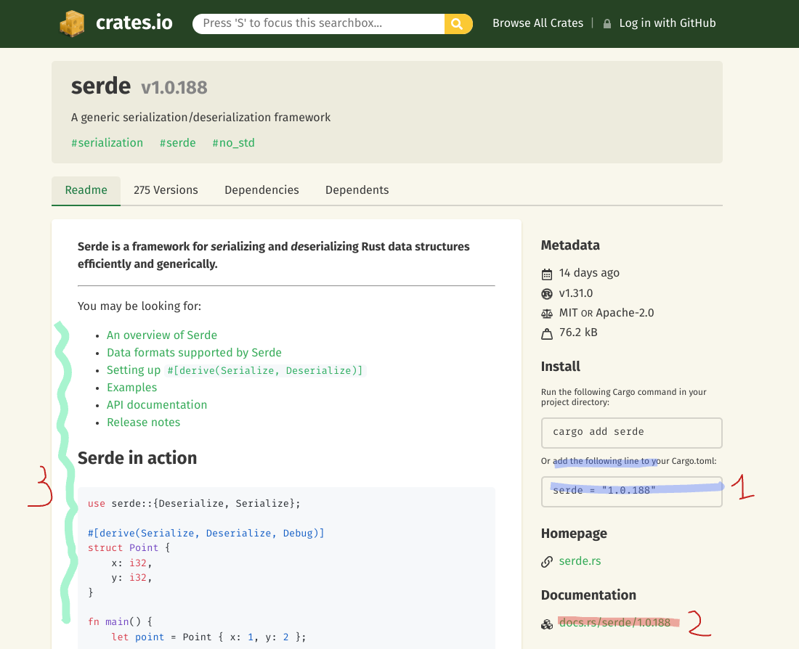

# Cargo : The rust package manager : Introduction

All modern languages have a package manager :
* Javascript has npm
* Java has maven and gradle
* C# has NuGet

It exists some open source projects to provide package management facility to C/C++ : [Conan.io](https://conan.io). C/C++ was not designed in its early stage to support package management. 

Cargo is the official package manager to develop rust application.

This is a command line interface (CLI). To create an empty rust project, just type :

```
cargo init my-new-project
```

will create the following files : 

```
.
├── Cargo.toml
└── src
    └── main.rs
```

You can then buid your project by moving into the folder cargo just created and typing : 

```
cargo build
```

To launch the program type : 

```
cargo run
```

# Definitions : 

## Crate : 
A crate is either **some** executables or **one** librarie.
A crate is described by a **cargo.toml** file.

# Conventions : 

All conventions may be overridden, here I give you the default behaviour of cargo. To override them read the [cargo book](https://doc.rust-lang.org/cargo/).

* `src/main.rs` is the entry point of the executable of a crate (if the crate contains one executable)
* `src/lib.rs` is the  entry point of the library of a crate.

# Adding a crate as a dependency

Cargo is a package manager so it is used to add and use other crate to your project.
Simply add this crate in the `[dependencies]` section of the `Cargo.toml` file.
Exemple to import the crate chrono (v0.4.29) : 
```
[dependencies]
chrono = "0.4.29"
```

All crates are hosted on a website : [crates.io](https://crates.io/).

Page of crates looks like that : 


1. The line to add in cargo.toml to import the dependency
2. Link to the full documentation
3. The cover page of the documentation. For basic usage of the crate, if the documentation is good, you will find what you need here.
