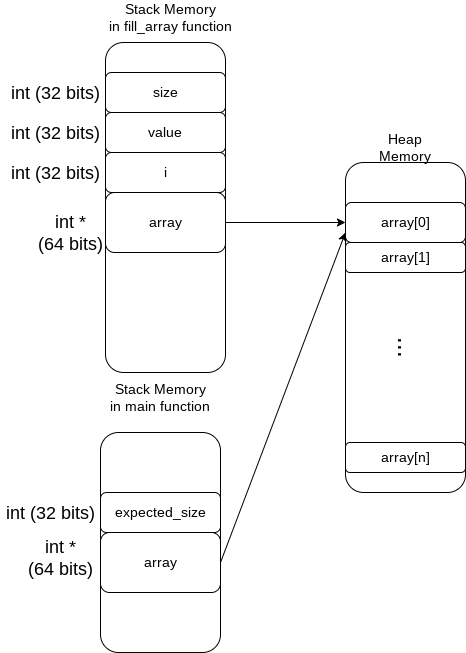

# Reference and ownership : 

The rustlang book says : 

*Ownership is Rust’s most unique feature and has deep implications for the rest of the language. It enables Rust to make memory safety guarantees without needing a garbage collector* 

## What is memory safety ?

Memory safety is the science to avoid : 
* Memory leak
* Dangling pointer or reference
* Usage of freed memory

### Stack vs Heap

There are two types of memory :
 * Stack : fast to access, size limited memory (8192 kbyte for each thread by default on linux). Easy to manage (compiler release memory as the variables goes out of scope).
 * Heap : only limited by hardware memory, but slower to access and tricky to manage.

In C++ we can create and release data on heap by using the `new` and `delete` keywords.

```c++
int* create_and_fill_array(int size, int value) {
    int *array = new int[size];
    for(int i = 0 ; i < size ; i++){
        array[i] = value;   
    }
    
    return array;
}

int main()
{
    int expected_size = 100;
    int *array = create_and_fill_array(expected_size, 1);
    std::cout << array[0] << std::endl;
    delete[] array
}
```




### Unsafe memory usage : 

In the above exemple, if programmer forgot to `delete[] array` we have a **memory leak**.

In the above exemple, if programmer swap the `cout` and the `delete` line, we have a **freed memory usage**.

In the bellow exemple (that compile, with a warning) `array` in main function refer to a memory area that is not the effective array ! We use a **dangling pointer**

```c++
int* create_and_fill_array_buggy(int size, int value) {
    int array[size];
    for(int i = 0 ; i < size ; i++){
        array[i] = value;   
    }
    
    return array;
}

int main()
{
    int expected_size = 100;
    int *array = create_and_fill_array(expected_size, 1);
    std::cout << array[0] << std::endl;
}
```

### Memory Management

All programming language have their own memory management strategy. Languages like Java, Javascript use a garbage collector to release memory of no longer used variables. C let the developper manage memory. Developer create an object with `malloc` and release memory with `free`. C++ has quite the same strategy with the `new` and `delete` keywords.

Patterns like RAII (Resource Acquisition Is Initialization) can be implemented in various language to ease memory management.

```c++
class IntArray {
public :
    IntArray(int size, int value) {
        array = new int[size];
        for(int i = 0 ; i < size ; i++){
            array[i] = value;
        }
    }
    ~IntArray() {
        delete[] array;
    }
    int operator[](size_t i){
        return array[i];
    }
    
private :
    int *array;
};

int main()
{
    IntArray array(100, 1);
    std::cout << array[0] << std::endl;
}
```

A generalized version for any type : 
```c++
template<typename T>
class Pointer {
public :
    Pointer(T* value):value(value) {}
    ~Pointer() {
        delete value;
    }
    T* operator->(){return value;}
    
private :
    T* value;
};

struct Position {
    double latitude;
    double longitude;
};

int main()
{
    Pointer<Position> position_ptr(new Position{43.0,6.0});
    std::cout << position_ptr->latitude << std::endl;
}
```
In rust, there is no `new` or `delete` keyword, we will use `Box` to create data on the heap. A `Box` is more or less the `Pointer` class described above.

```rust
struct Position{
    latitude: f64,
    longitude: f64
}

fn main() {
    let position = Box::new(Position{latitude: 43.0, longitude: 6.0});
    println!("Latitude : {}", position.latitude);
}
```

# Ownership
Ici, il faut mettre les slides du cours exail.