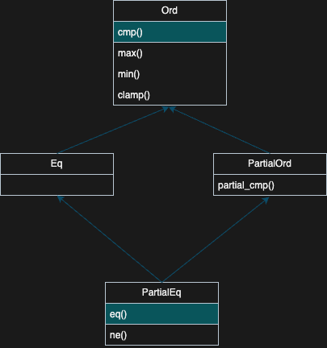
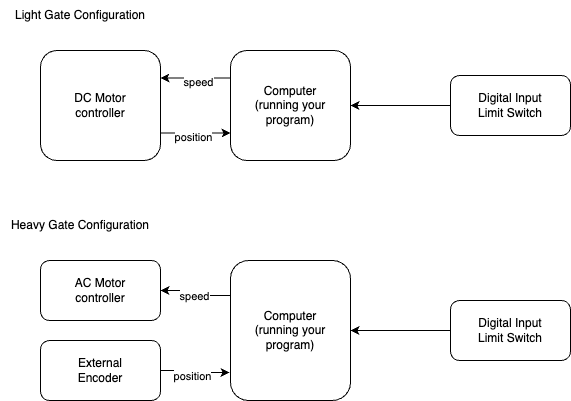
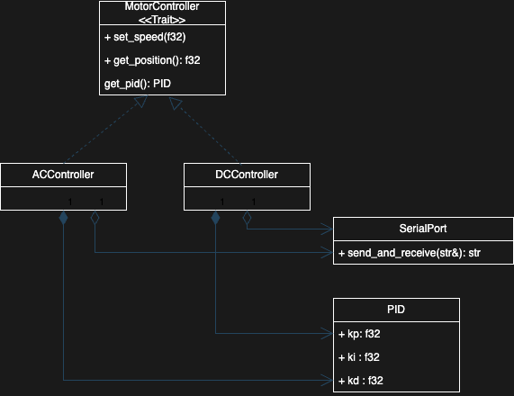

# Trait

In all Object Oriented Programing (OOP) languages, there is a feature allowing to share similar behaviour of object. In C++, we can use virtual methods and class inheritance. In Java, we define interfaces and subclasses... In rust we use **Traits**.

Here is an exemple in C++ that we will rewrite in rust : 

```c++
class Named {
public :
    Named(const std::string& name): m_name(name){}
    std::string WhatsYourName() {
        return m_name;
    }
private :
    std::string m_name;
}

class Teacher : public Named {
    Teacher(const std::string& name, int salary):
    Named(name),
    m_salary(salary) {}
}

class Student: public Named {
    Student(const std::string& name, const std::string& class):
    Named(name),
    m_class(class) {}
}

void main() {
    Teacher adrien("Adrien BARRAL", 40000);
    Student john("John Smith", "Master MIR");
    std::cout << adrien.WhatsYourName() " is a teacher of " << john.WhatsYourName() << std::endl;
}
```

```rust
trait Named {
    fn whats_your_name(&self) -> String;
}

struct Teacher {
    name: String,
    salary: u32
}

struct Student {
    name: String,
    class: String
}

impl Named for Student {
    fn whats_your_name(&self) -> String {
        self.name.clone()
    }
}

impl Named for Teacher {
    fn whats_your_name(&self) -> String {
        self.name.clone()
    }
}

fn main() {
    let adrien = Teacher{
        name: String::from("Adrien BARRAL"),
        salary: 40_000
    };
    let john = Student {
        name: "John".to_string(),
        class: "MIR".to_string()
    }
    println!("Hello {}", adrien.whats_your_name());
    println!("Hello {}", john.whats_your_name());

}
```

Here, we can have the feeling that we don't share a lot of behaviour in rust (compared to C++).

But now, let create a method that guess if a name is nice or not : 

```rust
fn does_its_name_is_nice(named: &dyn Named) -> bool {
    named.whats_your_name().contains("Adrien")
}
```

We can use this method : 

```rust
fn main() {
    let adrien = Teacher{
        identity: Identity{name: String::from("Adrien BARRAL")},
        salary: 40_000
    };
    
    let john = Student {
        identity: Identity(name: String::from("John SMITH")),
        class: String::from("MIR Master")
    };
    assert_eq!(does_its_name_is_nice(&adrien), true);
    assert_eq!(does_its_name_is_nice(&john.identity), false);
}
```

This is how we share behaviour in Rust. We create a trait, then we create function that know how to process this trait. Finally we implement this trait for our structures.

## The `dyn` keyowrd :

I decide to pass as argument of my trait processing method the following type : `&dyn Named`. That can be translated by *a reference to an object that implements the trait Named that will be discover dynamically*.
I would also be able to write the following signature :  `fn does_its_name_is_nice(named: &impl Named) -> bool`. Here we use **static dispatch**. To understand the difference between static and dynamic distpatch, you can read [this nice article](https://www.cs.brandeis.edu/~cs146a/rust/doc-02-21-2015/book/static-and-dynamic-dispatch.html). But this is out of scope of this course.

Static dispatching generate more code, but is more straight forward at runtime (it consume less CPU). Dynamic dispatching have a very slight CPU overload. In C++, we don't have choice, only dynamic dispatching is implemented (or maybe you can decide to do static dispatching if you master meta programming tricks.).

Dynamic dispatching allow the creation of factory methods and polymorphism like this : 

```rust
fn main() {

    let mut everybody = Vec::<Box<dyn Named>>::new();
    everybody.push(Box::new(Teacher{...}));
    everybody.push(Box::new(Student{...}));

    for named in everybody {
        println!("Hello : {}", named.whats_your_name());
    }
}
```

Here we can't write a vector with the following type : ```Vec<dyn Named>```because size of the inner type of a vector must known at compile time (to allow the Vector collection to allocate properly the memory).

## The `derive` macro is just code generation :

You may notice than in C++ we can both share behaviour and data thanks to inheritance. In rust we can't. Behaviour is shared between objects thanks to traits, or methods that take references to traits in arguments. You will encounter a macro called **derive**. This macro will allow a good developper to create library that do kind of introspection at compile time on a rust structure.

*I never had to create my own derive macro, most of the time if you think you need it is because you try to solve a problem in a C++ fashion rather than in a rust one*

If you are intersted in exploring powerfull of procedural macro in rust, start by reading [this small article](https://web.mit.edu/rust-lang_v1.25/arch/amd64_ubuntu1404/share/doc/rust/html/book/first-edition/procedural-macros.html).

## Exercice : Implementing a trait on a custom structure to use built-in functions.
Imagine we have a custom structure describing a Person : 
```rust
struct Person {
    name: String
    age: u8
}
```

We have a vector (convertible into a slice) of person, and we want to sort this vector by age. It exists a method ```sort``` on slice that have the following signature :
```rust
impl<T> [T]
pub fn sort(&mut self)
where
    T: Ord
{}
```
That we can read as : *We implement the method sort for a mutable slice of elements of type T where T implement the trait Ord*.

So if you implement the trait Ord for the struct Person, we will be able to sort a vector of person (by age) by calling the method sort. This the what you have to do in the ex8.

To implement the ```Ord``` trait, you have to [read the documentation](https://doc.rust-lang.org/std/cmp/trait.Ord.html) of this trait. This trait is defined with : 
```rust
pub trait Ord: Eq + PartialOrd
```
That means that a type implementing ```Ord``` must also implements ```Eq``` and ```PartialOrd```... By reading docs of all this traits, we can see that the following traits will need to be implemented : 


When you will have finish this exercice, you may think that this is a lot of work for a so common problem.
This is why it exists another sort method called ```sort_by```allowing to provide a comparison method.

## Additional exercice : Polymorphism

You have to develop firmware of an automatic gate. The electronic department of the firm you work for did not found a universal motor controller. So, there is two configurations. One for light gates, and other one for heavy gates. Both architecures are shown in the figure bellow.


The problem is that both motor controller does not have the same communication protocol. Table bellow describe these protocols : 

|Command|DC Controller|AC Controller|
| ----- | ----------- | ----------- |
| Interrogation | ? | ? | 
| Get Position | POS? | POSITION? |
| Set Speed | SET_POINT_SPEED,<f32> | SET_SPEED,<f32> |

In response to a Get Position request, both controllers return a ```f32``` that you can parse with the builtin method : ```f32::parse(&str)```

In response to an Interrogation request (?), the DC Controller wil reply with the string "DC", and the AC Controller with the string "AC".

Ex7 is containing three sources files that you should not edit : 
* main.rs : The main loop
* emulator.rs : An emulator of the Motor and device to control this motor
* plotter.rs : The boilerplate to display a plot of the motor position.

You must only edit the file named controller.rs.

In this file you must implement the MotorController trait accordingly to the protocol described above. Architecture of this file will be : 



