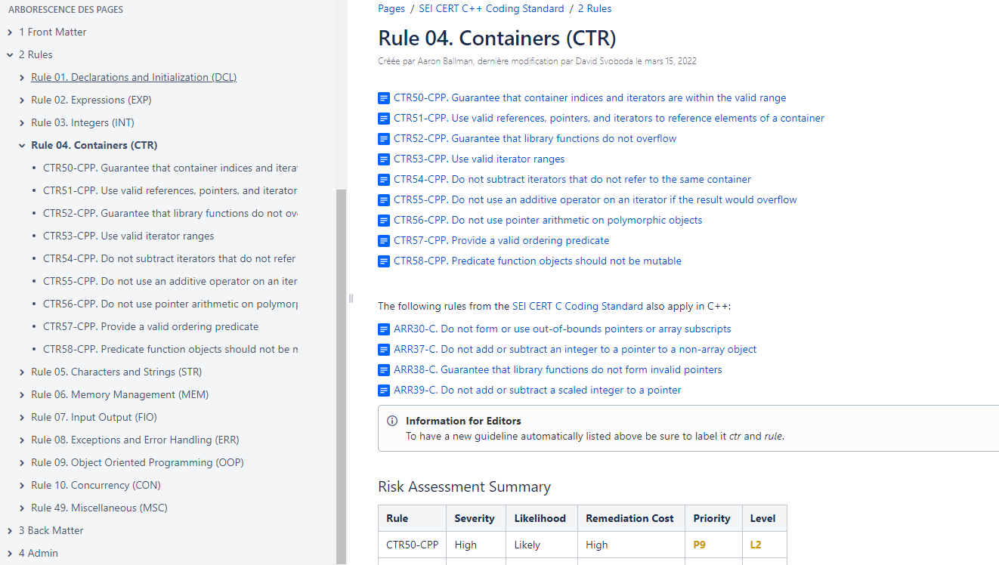

# Why rust ?

Because industry need a **system programming language** without compromise on : 
* Performance
* Reliability : 
  * Memory Safety 
  * Concurrency Safety

## Source of common bugs

When writting a program with a system programming language, most of the bugs (undefined behaviours of the software) are the consequence of : 
* A memory corruption
  * Out of bound memory access
  * Usage of an unitialized or already deleted object
* A concurrent access to a same object.

## Other system languages are too much permissive 

To tackle most of the common mistakes a developper can do, it is encouraged to follow **coding standards** ([SEI CERT](https://wiki.sei.cmu.edu/confluence/pages/viewpage.action?pageId=88046682), MISRA, [CPP core guidelines](https://isocpp.github.io/CppCoreGuidelines/CppCoreGuidelines)).

For exemple C++ SEI CERT coding standard contains 85 rules on the following topics :


Exemple of a syntactillay correct program that cause a program crashing : 

```c
#include <stdio.h>
#include <stdlib.h>
#include <string.h>

int main(void) {
    char *x = strdup("Hello");
    free(x);
    printf("%s\n", x);
}
```

This programm will compile without any problem ! Neverless the `printf` of `x` after the call of `free` has an undefined behaviour.

Equivalent of this program in rust will look like this : 
```rust
fn main() {
    let x = String::from("Hello");
    drop(x);
    println!("{}", x);
}
```

This programm **will not compile** and will generate an error (that we will understand further in this course) : 

```
error[E0382]: borrow of moved value: `x`
 --> src/main.rs:4:20
  |
2 |     let x = String::from("Hello");
  |         - move occurs because `x` has type `String`, which does not implement the `Copy` trait
3 |     drop(x);
  |          - value moved here
4 |     println!("{}", x);
  |                    ^ value borrowed here after move
  |
  = note: this error originates in the macro `$crate::format_args_nl` which comes from the expansion of the macro `println` (in Nightly builds, run with -Z macro-backtrace for more info)

For more information about this error, try `rustc --explain E0382`.
```

## Rust also have some coding standard

ANSSI (Agence Nationale de la Securité des Systèmes d'Information), have published one focused on Security. This is a small coding standard (< 30 rules and recommandations) due to the intrinsic reliability of the rust programming language.

There will be new coding standards focused on other topics, MISRA is [working on it](https://github.com/PolySync/misra-rust/tree/master), but no thing finished yet.